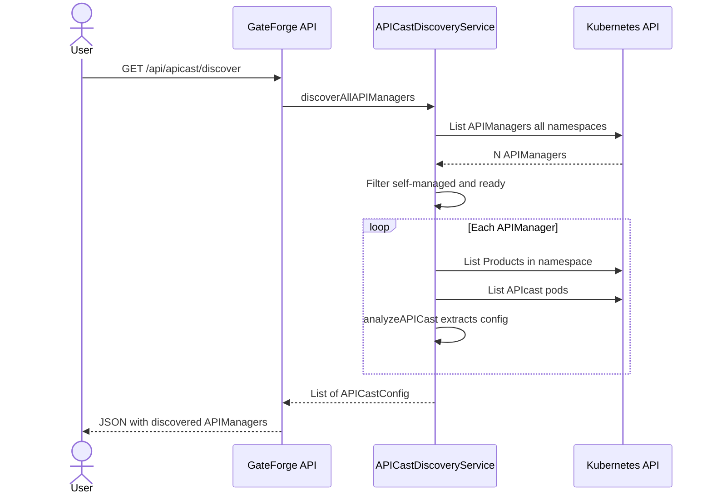
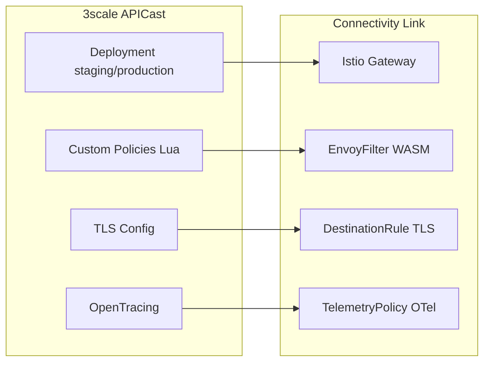

# APICast Discovery and Migration

GateForge v0.1.9 introduces the ability to **discover APICast self-managed and multi-tenant gateways** from `APIManager` CRDs in OpenShift, analyze their configuration, and map them to equivalent **Istio/Connectivity Link** resources.

## What is APICast?

APICast is the API gateway component of Red Hat 3scale API Management. It can be deployed in two modes:

| Mode | Description | GateForge Support |
|------|-------------|-------------------|
| **Hosted** | Managed by 3scale SaaS, no cluster-local pods | Not applicable (no CRD to discover) |
| **Self-Managed** | Deployed via `APIManager` CRD with staging/production specs | Fully supported |
| **Multi-Tenant** | Single `APIManager` with multiple tenants sharing the gateway | Fully supported |

## APICast Scenarios in This Workshop

The workshop deploys **4 APICast scenarios** in the cluster, all backed by **Microcks** mock APIs:

### Scenario 1: Self-Managed APICast (API Key)

- **Namespace**: `apicast-scenario-1`
- **APIManager**: `apicast-self-apikey`
- **Product**: Account Management API
- **Auth**: API Key (`user_key`)
- **Backend**: Microcks `Account Management API/1.0`

### Scenario 2: Self-Managed APICast (OIDC)

- **Namespace**: `apicast-scenario-2`
- **APIManager**: `apicast-self-oidc`
- **Product**: Wire Transfer API
- **Auth**: OpenID Connect (Keycloak)
- **Backend**: Microcks `Wire Transfer API/1.0`

### Scenario 3: Multi-Tenant APICast

- **Namespace**: `apicast-scenario-3`
- **APIManager**: `apicast-multi-tenant`
- **Products**: Card Issuing API (Tenant Cards) + KYC Verification API (Tenant KYC)
- **Auth**: API Key per tenant
- **Backend**: Microcks `Card Issuing API/1.0` and `KYC Verification API/1.0`

### Scenario 4: Custom Policies + TLS

- **Namespace**: `apicast-scenario-4`
- **APIManager**: `apicast-custom-tls`
- **Product**: Account Management API (with rate-limit Lua policy)
- **Features**: Custom Lua policy, TLS verification (depth 3), OpenTracing (Jaeger)
- **Backend**: Microcks `Account Management API/1.0`

---

## How GateForge Discovers APICast

GateForge scans the cluster for `APIManager` CRDs and filters for instances that have:

1. **`spec.apicast`** present (self-managed deployment)
2. **`Available` condition** in status (ready to serve traffic)



## Step-by-Step: Discover, Analyze, and Map

### Step 1: Discover All APIManagers

```bash
GATEFORGE_URL="https://gateforge-gateforge.apps.YOUR_CLUSTER_DOMAIN"
curl -s "$GATEFORGE_URL/api/apicast/discover" | jq .
```

Expected output:

```json
{
  "total": 4,
  "apiManagers": [
    {
      "name": "apicast-self-apikey",
      "namespace": "apicast-scenario-1",
      "status": "ready",
      "stagingReplicas": 1,
      "productionReplicas": 1,
      "customPolicies": 0,
      "tlsEnabled": false,
      "tracingEnabled": false
    }
  ]
}
```

### Step 2: Analyze a Specific APIManager

```bash
curl -s "$GATEFORGE_URL/api/apicast/analyze/apicast-scenario-4/apicast-custom-tls" | jq .
```

This returns the full `APICastConfig` including custom policies, TLS settings, and OpenTracing configuration.

### Step 3: Map APICast to Istio Resources

```bash
curl -s -X POST "$GATEFORGE_URL/api/apicast/map" \
  -H "Content-Type: application/json" \
  -d '{"namespace":"apicast-scenario-4","name":"apicast-custom-tls"}' | jq .
```

This generates:
- **Istio Gateway** (staging + production)
- **EnvoyFilter** for each custom policy (Lua to WASM mapping)
- **DestinationRule** with TLS configuration
- **TelemetryPolicy** for OpenTracing to OpenTelemetry migration

---

## APICast to Connectivity Link Mapping



| APICast Component | Connectivity Link Equivalent | Notes |
|-------------------|------------------------------|-------|
| `stagingSpec` / `productionSpec` | `Gateway` (per environment) | Replica count preserved as annotation |
| Custom Policies (Lua) | `EnvoyFilter` | Lua scripts mapped to Envoy Lua filter; WASM migration recommended |
| TLS verification | `DestinationRule` | CA cert references preserved |
| OpenTracing (Jaeger) | `Telemetry` (OpenTelemetry) | Jaeger collector mapped to OTel provider |
| Service exposure | `ServiceEntry` | External service resolution for backends |

## API Endpoints

| Endpoint | Method | Description |
|----------|--------|-------------|
| `/api/apicast/discover` | GET | Discover all APIManagers with self-managed APICast |
| `/api/apicast/discover/{namespace}` | GET | Discover APIManagers in a specific namespace |
| `/api/apicast/analyze/{namespace}/{name}` | GET | Analyze specific APIManager configuration |
| `/api/apicast/map` | POST | Map APICast config to Istio resources |
| `/api/apicast/map-all` | POST | Batch map all discovered APICasts |

## Verifying the Scenarios

After deploying the workshop, verify the 4 scenarios are running:

```bash
for ns in apicast-scenario-1 apicast-scenario-2 apicast-scenario-3 apicast-scenario-4; do
  echo "=== $ns ==="
  oc get apimanagers -n $ns -o name 2>/dev/null || echo "  No APIManagers"
  oc get products.capabilities.3scale.net -n $ns -o name 2>/dev/null || echo "  No Products"
done
```

Then use GateForge to discover and migrate them:

```bash
# Discover
curl -s "$GATEFORGE_URL/api/apicast/discover" | jq '.total'

# Map all
curl -s -X POST "$GATEFORGE_URL/api/apicast/map-all" | jq '.totalResources'
```
